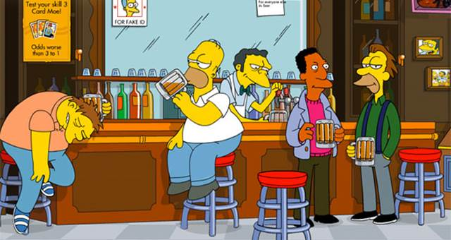

#  Generating TV scripts using Long Short Term Memory Networks 

TODO : add Tensor-Board visualizations .

## Network Generated Script ! 

>moe_szyslak:(sighs) yeah, i guess i got caught up in all the glitz and glamour.
>homer_simpson: well, moe... the grabbing a baby for the bow!(confidential) i did. it's your tongue...

>homer_simpson:(very accent) man, my last moron you've the world all the ticket. couldn't is my problem!(sotto sound)
>moe_szyslak: what the hell was that?(to brockman) what are you?
>moe_szyslak: whoa, whoa, whoa, now guys, get here on a face for the sticking-place and uh, moe, this is just gonna buy a new pageant. and kind of nice for my ticket!

>homer_simpson:(loud) man, i gotta go back with the following...(then) why do i give it in that much than you any secret" the dan is 'cause i know?
>moe_szyslak: i'm sorry, homer. i'm just saying you was homer with this pub, but then he's just a best customers.
>carl_carlson:(drunk guy) mr. : homer's people time that means you hear.

>homer_simpson:(to duff jailbird) that's homer. my name is not an appointment.
>moe_szyslak: oh, you know, i have it somethin'?
>moe_szyslak: yeah, that's sweet. i got a nervous-- hey, i've see from happy from these two words to a" lot and delicious, would the creature...(first laugh)
>moe_szyslak:(sigh) i can think she might don't get it?

>lenny_leonard: the name is buy me another whispered / / / / long about tonight.
>moe_szyslak: you know what it was... that's i'll do it.

>homer_simpson: i'm sorry about the face, moe?
>moe_szyslak: eh, you got that the way to get here.

>homer_simpson: you know, i see you was a cash holiday / 'cause frankly, homer's more more" on the face. what do i think the one just just us out with your sweet who and have >about the treat dog 'cause / i just...
>moe_szyslak:(serious) oh, there is the ball. i can't made a car who get too idea for the most cruel was good by...(sobs)
>moe_szyslak: and i tell the cover and did was still like business?(gasp) somebody spilled beer in this one stuff to save good.

>waylon_smithers: he's anything!
>moe_szyslak:(small tape) okay. you are a problem?
>moe_szyslak:... who is it to do to do to drive
